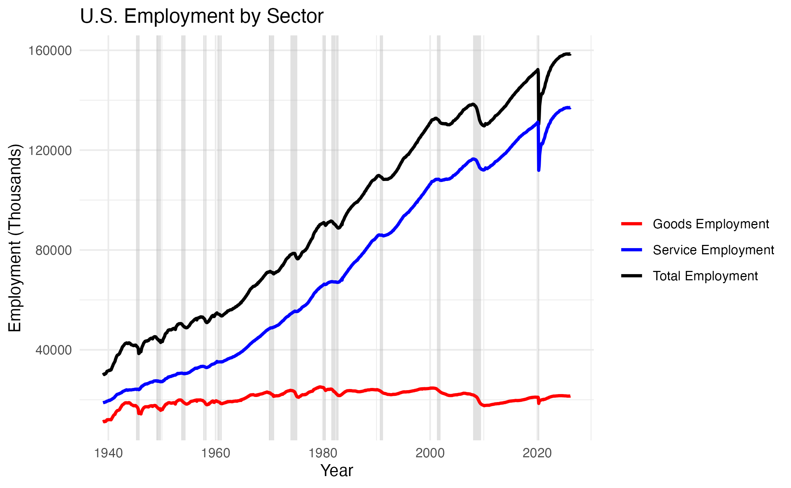

```{r setup, include = FALSE}
# set global options
knitr::opts_chunk$set(echo = FALSE, message = FALSE, warning = FALSE, results = FALSE)
# Set the working directory to be the project directory (aka root or top-level directory)
knitr::opts_knit$set(root.dir = here:: here())
```

```{r Package Import, include=FALSE}
library(here)
library(knitr)
library(devtools)
library(tidyverse)
library(rticles)
library(bookdown)
library(kableExtra)
library(ggthemes)
library(stargazer)
library(pander)
```

## Introduction

The Trump Administration's One Big Beautiful Bill represented the largest upward transfer of wealth in the history of the United States. But its coverage largely obscured that fact, focusing instead on Republican unity in passing the legislation in spite of the losses that many rank-and-file Republican voters would face rather than the substantive impacts and world historic implications of the bill. This coverage mirrors many of the other economic victories that Trump has amassed for the top 1% during his second administration: the vicissitudes of realpolitik take precedence over the ways that those victories shape long-term outcomes for the working class. It can be easy to pin this on corporate media and its increasing desire to monetize views through the medium of feeding into partisan conflict particularly over the last 30 years \[cite\], but I think to do this under-emphasizes the ways that this type of centrality of the elite driven two-party conflict over the effects of the mass public finds flourish and analogue in the broader macro-economy itself.

How we talk about economic retrenchment, I argue, is downstream from the fact that changes in the American Political Economy have meant that what we don't consider crises paper over forms of risk-shifting [@hacker2004] that are occurring at faster and faster rates. Recent work by Dara Strolovitch makes the claim that:

> "the very notion of economic crisis relies on assumptions and practices that reflect, reproduce, and constitute prevailing attitudes and normative expectations about racialized and gendered labor and economic inequalities." [@strolovitch2023]

This astute point, I argue, is being exacerbated and expanded by the fact that as wealth concentrates in a more dramatic fashion, it ironically becomes routinized, expanding the bounds of what she calls a "non-crisis" [@strolovitch2023].

This is playing out not just in terms of the expansion of something like debt and housing burden (though those are key players in this story) but in terms of how we understand and adjudicate broader macroeconomic health. While the United States is being driven further into unprecedented levels of financial precarity, it has somehow avoided the dreaded "R" word: recession. This is primarily attributed to both the cautious maneuvering of the Federal Reserve and the paper tiger of AI investment. Both of these factors, I argue, actually highlight the ways in which conceptions of macroeconomic health are increasingly divorced from the financial realities of most Americans. This is not to say that race and gender are not still powerful tools through which we can understand the depths of disparities that people are facing. Rather, the types of financial cushion offered by whiteness and masculinity are increasingly slipping as social forces, instead giving way to to an ever narrowing group of people unaffected by what Hacker calls "risk contagion" that is being spread to more people up and down the income distribution in disturbing and sometimes surprising combinations [@hacker2004].

I argue that once we frontload substantive measures that focus on economic pain at the household and community level rather than macroeconomic resilience at the level of the multinational firm, we begin to see that the information something like a declaration of recession is supposed to give us is largely irrelevant to a large proportion of Americans. I theorize this casualization of crisis as "the endemic recession."

## Proceeding with Caution: Recessions and Wealth Concentration

What is the use value of knowing a country is in recession? Well, for one, it highlights where a country is within a basic business cycle. As most economists will attest, recessions are retrospective vehicles. They are indications of whether the country has been through the last stage of a business cycle that has been characterized by expansion, then a sputtering into slow down (often referred to as a peak), a low point (called a trough), a period of speeding up then blowing past its prior point of initial slowing down (called a recovery), until it finally begins to expand again. Implicit in this configuration is the sense that if you look at major macroeconomic outcomes, the expectation is overtime growth in a secular fashion that contains a cycle within it.

@fig-history demonstrates this phenomenon. While each shaded region representing a recession shows a dip in growth, the overall trajectory of growth is upward. We can also see in this chart a broader story of manufacturing job loss as the Goods Employment is on a steady downturn. So even as there is a secular increase in the overall number of jobs which should reflect a broader resilience against economic downturn, this resilience isn't reflected at the sectoral level.

{#fig-history}

## Housing Burden Is More than Housing Burden

\newpage 
\begin{center}
  \textbf{Works Cited}
\end{center}
